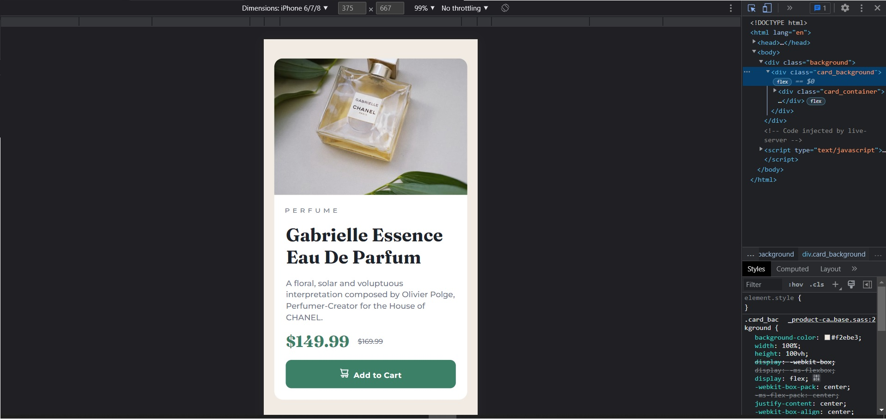

# Frontend Mentor - Product preview card component solution

This is a solution to the [Product preview card component challenge on Frontend Mentor](https://www.frontendmentor.io/challenges/product-preview-card-component-GO7UmttRfa). Frontend Mentor challenges help you improve your coding skills by building realistic projects.

## Table of contents

- [Overview](#overview)
  - [The challenge](#the-challenge)
  - [Screenshots](#screenshots)
  - [Links](#links)
- [My process](#my-process)
  - [Built with](#built-with)
  - [What I learned](#what-i-learned)
  - [Useful resources](#useful-resources)
- [Author](#author)
- [Acknowledgments](#acknowledgments)

## Overview

### The challenge

Users should be able to:

- View the optimal layout depending on their device's screen size
- See hover and focus states for interactive elements

### Screenshots

Below you can see the screenshots of my solution

There weren't any photos of the actual design on the landscape view on mobile, but I took care of that anyway.

### Links

- Solution URL: (https://www.frontendmentor.io/solutions/product-card-made-with-flexbox-and-preprocessor-sass-nmmBzDZlRk)
- Live Site URL: (https://kamilp522.github.io/Product-preview-card-made-with-flexbox-and-sass/)

## My process

### Built with

- Semantic HTML5 markup
- CSS custom properties
- Flexbox
- CSS Grid
- Mobile-first workflow
- [Sass](https://sass-lang.com/) - preprocessor for css

### What I learned

I used this exercise to practice responsive web design and get a better understanding of sass by incomporating it into my project (even though project wasn't big)

### Useful resources

- (https://www.youtube.com/watch?v=3R4fpnIAozs&t=457s&ab_channel=TheNetNinja) - Really nice video explaining how to incomporate media querries into the project while using sass.

## Author

- Frontend Mentor - [@kamilp522](https://www.frontendmentor.io/profile/kamilp522)

## Acknowledgments

This is my first project submitted on the frontendmentor.io and I'm sure it's not last. I'm looking forward to the next challenge and hope to submit more solutions pretty soon.
